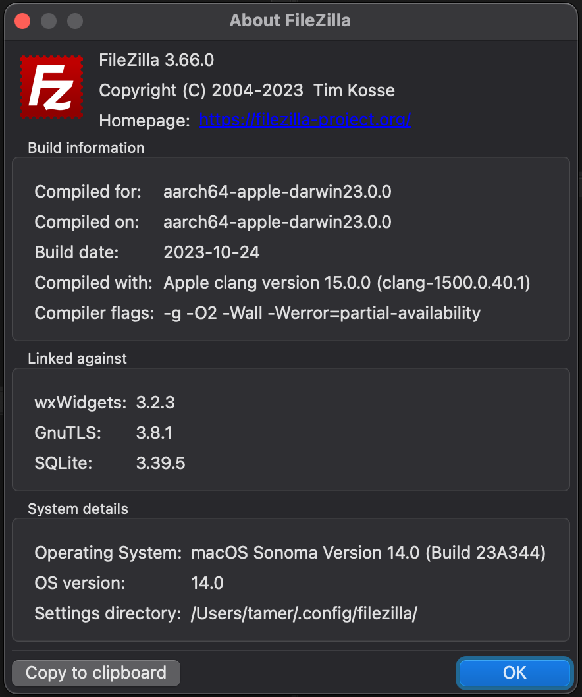

# FileZilla macOS ARM
Binaries compiled for the Apple M1/2 because the developers refuse to do it themselves. Compiled and tested on Sonoma 14.0 on a Macbook Pro 14 M1 Pro.

Update: As of December 2023, FileZilla finally decided to release aarch binaries, making this repository redundant: https://filezilla-project.org/download.php?show_all=1

[](https://github.com/dqos/filezilla-arm/releases)

### Download
Download the latest version here: https://github.com/dqos/filezilla-arm/releases

### Installation
- Drag and drop FileZilla.app into your Application folder.

### Compiling
1. Install the dependencies using brew `brew install pkg-config libidn GMP Nettle GnuTLS SQLite gettext wxWidgets`.
2. Now copy-paste their environments (taken from https://wiki.filezilla-project.org/Compiling_FileZilla_3_under_macOS):
```shell
mkdir -p "$HOME/filezilla/prefix"
mkdir -p "$HOME/filezilla/src"
export CC="clang -mmacosx-version-min=10.13"
export CXX="clang++ -std=c++17 -stdlib=libc++ -mmacosx-version-min=10.13"
export OBJC="clang -mmacosx-version-min=10.13"
export OBJCXX="clang++ -std=c++17 -stdlib=libc++ -mmacosx-version-min=10.13"
export AS="as -mmacosx-version-min=10.13"
export LD="ld -macosx_version_min 10.13"
export PATH="$HOME/prefix/bin:$PATH"
export CPPFLAGS="-I$HOME/prefix/include"
export LDFLAGS="-L$HOME/prefix/lib"
export LD_LIBRARY_PATH="$HOME/prefix/lib"
export PKG_CONFIG_PATH="$HOME/prefix/lib/pkgconfig"
```
3. Now compile libfilezilla:
```shell
cd ~/filezilla/src
curl -OL https://download.filezilla-project.org/libfilezilla/libfilezilla-0.45.0.tar.xz
tar xf libfilezilla-0.45.0.tar.xz
cd libfilezilla-0.45.0
./configure --prefix="$HOME/filezilla/prefix" --enable-shared --disable-static
make
make install
```

4. Now compile FileZilla:
```shell
cd ~/filezilla/src
curl -OL https://download.filezilla-project.org/client/FileZilla_3.66.0_src.tar.xz
tar xvjf FileZilla_3.66.0_src.tar.xz
cd filezilla-3.66.0
./configure --with-pugixml=builtin
make
```

5. Finally codesign the .app file: `codesign --force --deep -s <YOURCERT> FileZilla.app`
